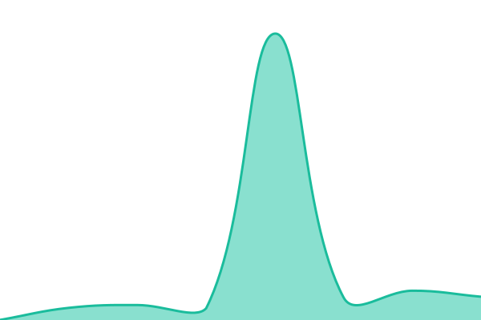
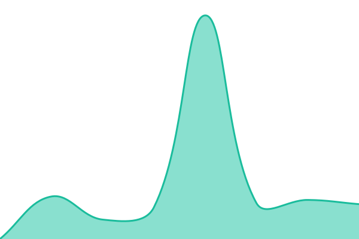
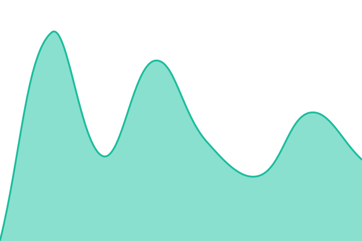
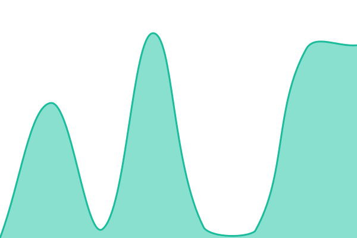
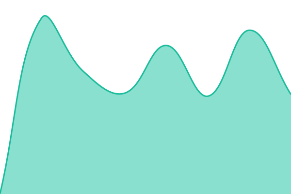
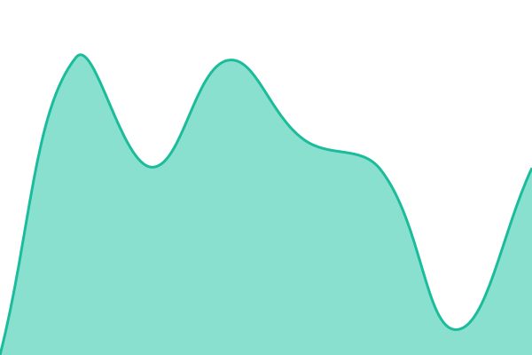

# [📈 Live Status](https://fraserbooth.github.io/fb-monitor): <!--live status--> **🟧 Partial outage**

This repository contains the open-source uptime monitor and status page for [fraserbooth](https://fraserbooth.github.io/fb-monitor), powered by [Upptime](https://github.com/upptime/upptime).

With [Upptime](https://upptime.js.org), you can get your own unlimited and free uptime monitor and status page, powered entirely by a GitHub repository. We use [Issues](https://github.com/fraserbooth/optbp-monitor/issues) as incident reports, [Actions](https://github.com/fraserbooth/optbp-monitor/actions) as uptime monitors, and [Pages](https://fraserbooth.github.io/fb-monitor) for the status page.

<!--start: status pages-->
<!-- This summary is generated by Upptime (https://github.com/upptime/upptime) -->
<!-- Do not edit this manually, your changes will be overwritten -->
<!-- prettier-ignore -->
| URL | Status | History | Response Time | Uptime |
| --- | ------ | ------- | ------------- | ------ |
|  [OptBP Site](http://www.optbp.com/) | 🟩 Up | [opt-bp-site.yml](https://github.com/fraserbooth/fb-monitor/commits/HEAD/history/opt-bp-site.yml) | 

 220ms
     
 | 

<a href="https://fraserbooth.github.io/fb-monitor/history/opt-bp-site">100.00%</a>
    

|  [Remote Check In Site](https://www.remotecheckin.co.uk/) | 🟥 Down | [remote-check-in-site.yml](https://github.com/fraserbooth/fb-monitor/commits/HEAD/history/remote-check-in-site.yml) | 

 170ms
     
 | 

<a href="https://fraserbooth.github.io/fb-monitor/history/remote-check-in-site">0.00%</a>
    

|  [OptBP Pt](https://pt.optbp.com/) | 🟩 Up | [opt-bp-pt.yml](https://github.com/fraserbooth/fb-monitor/commits/HEAD/history/opt-bp-pt.yml) | 

 465ms
     
 | 

<a href="https://fraserbooth.github.io/fb-monitor/history/opt-bp-pt">100.00%</a>
    

|  [OptBP Clin](https://clin.optbp.com/) | 🟩 Up | [opt-bp-clin.yml](https://github.com/fraserbooth/fb-monitor/commits/HEAD/history/opt-bp-clin.yml) | 

 471ms
     
 | 

<a href="https://fraserbooth.github.io/fb-monitor/history/opt-bp-clin">100.00%</a>
    

|  [OptBP Auth](https://auth.optbp.com/Account/LoginWithPasscode) | 🟩 Up | [opt-bp-auth.yml](https://github.com/fraserbooth/fb-monitor/commits/HEAD/history/opt-bp-auth.yml) | 

 522ms
     
 | 

<a href="https://fraserbooth.github.io/fb-monitor/history/opt-bp-auth">100.00%</a>
    

|  [OptBP API](https://api.optbp.com/api/practice/additionaldetails/) | 🟥 Down | [opt-bp-api.yml](https://github.com/fraserbooth/fb-monitor/commits/HEAD/history/opt-bp-api.yml) | 

 365ms
     
 | 

<a href="https://fraserbooth.github.io/fb-monitor/history/opt-bp-api">0.00%</a>
    

|  [OptBP OCR](https://ocr.optbp.com/) | 🟥 Down | [opt-bp-ocr.yml](https://github.com/fraserbooth/fb-monitor/commits/HEAD/history/opt-bp-ocr.yml) | 

 19522ms
     
 | 

<a href="https://fraserbooth.github.io/fb-monitor/history/opt-bp-ocr">0.00%</a>
    

|  [Hangfire](https://api.optbp.com/hangfire) | 🟩 Up | [hangfire.yml](https://github.com/fraserbooth/fb-monitor/commits/HEAD/history/hangfire.yml) | 

 328ms
     
 | 

<a href="https://fraserbooth.github.io/fb-monitor/history/hangfire">100.00%</a>
    

|  [OptBP Test Pt](https://optbp-pt-test.azurewebsites.net/) | 🟩 Up | [opt-bp-test-pt.yml](https://github.com/fraserbooth/fb-monitor/commits/HEAD/history/opt-bp-test-pt.yml) | 

 500ms
     
 | 

<a href="https://fraserbooth.github.io/fb-monitor/history/opt-bp-test-pt">100.00%</a>
    

|  [OptBP Test Clin](https://optbp-clin-test.azurewebsites.net/) | 🟩 Up | [opt-bp-test-clin.yml](https://github.com/fraserbooth/fb-monitor/commits/HEAD/history/opt-bp-test-clin.yml) | 

 481ms
     
 | 

<a href="https://fraserbooth.github.io/fb-monitor/history/opt-bp-test-clin">100.00%</a>
    

|  [OptBP Test Auth](https://optbp-auth-test.azurewebsites.net/Account/LoginWithPasscode) | 🟩 Up | [opt-bp-test-auth.yml](https://github.com/fraserbooth/fb-monitor/commits/HEAD/history/opt-bp-test-auth.yml) | 

 512ms
     
 | 

<a href="https://fraserbooth.github.io/fb-monitor/history/opt-bp-test-auth">100.00%</a>
    

|  [OptBP Test API](https://optbp-api-test.azurewebsites.net/api/practice/additionaldetails/) | 🟥 Down | [opt-bp-test-api.yml](https://github.com/fraserbooth/fb-monitor/commits/HEAD/history/opt-bp-test-api.yml) | 

 490ms
     
 | 

<a href="https://fraserbooth.github.io/fb-monitor/history/opt-bp-test-api">0.00%</a>
    

|  [OptBP Dev Pt](https://optbp-dev-pt.azurewebsites.net/) | 🟩 Up | [opt-bp-dev-pt.yml](https://github.com/fraserbooth/fb-monitor/commits/HEAD/history/opt-bp-dev-pt.yml) | 

 1731ms
     
 | 

<a href="https://fraserbooth.github.io/fb-monitor/history/opt-bp-dev-pt">100.00%</a>
    

|  [OptBP Dev Clin](https://optbp-dev-clin.azurewebsites.net/) | 🟩 Up | [opt-bp-dev-clin.yml](https://github.com/fraserbooth/fb-monitor/commits/HEAD/history/opt-bp-dev-clin.yml) | 

 1506ms
     
 | 

<a href="https://fraserbooth.github.io/fb-monitor/history/opt-bp-dev-clin">100.00%</a>
    

|  [OptBP Dev Auth](https://optbp-dev-auth.azurewebsites.net/Account/LoginWithPasscode) | 🟩 Up | [opt-bp-dev-auth.yml](https://github.com/fraserbooth/fb-monitor/commits/HEAD/history/opt-bp-dev-auth.yml) | 

 9059ms
     
 | 

<a href="https://fraserbooth.github.io/fb-monitor/history/opt-bp-dev-auth">98.01%</a>
    

|  [OptBP Dev API](https://optbp-dev-api.azurewebsites.net/api/practice/additionaldetails/) | 🟥 Down | [opt-bp-dev-api.yml](https://github.com/fraserbooth/fb-monitor/commits/HEAD/history/opt-bp-dev-api.yml) | 

 482ms
     
 | 

<a href="https://fraserbooth.github.io/fb-monitor/history/opt-bp-dev-api">0.00%</a>
    

|  [Palma](https://www.comebacktopalma.info/) | 🟩 Up | [palma.yml](https://github.com/fraserbooth/fb-monitor/commits/HEAD/history/palma.yml) | 

 218ms
     
 | 

<a href="https://fraserbooth.github.io/fb-monitor/history/palma">100.00%</a>
    

|  [Aura-Soma](https://www.aura-soma.com/) | 🟩 Up | [aura-soma.yml](https://github.com/fraserbooth/fb-monitor/commits/HEAD/history/aura-soma.yml) | 

 555ms
     
 | 

<a href="https://fraserbooth.github.io/fb-monitor/history/aura-soma">98.16%</a>
    

|  [AEOS](https://www.aeos.net/) | 🟩 Up | [aeos.yml](https://github.com/fraserbooth/fb-monitor/commits/HEAD/history/aeos.yml) | 

 640ms
     
 | 

<a href="https://fraserbooth.github.io/fb-monitor/history/aeos">98.16%</a>
    

|  [ShireFarm](https://www.shirefarm.co.uk/) | 🟩 Up | [shire-farm.yml](https://github.com/fraserbooth/fb-monitor/commits/HEAD/history/shire-farm.yml) | 

 211ms
     
 | 

<a href="https://fraserbooth.github.io/fb-monitor/history/shire-farm">100.00%</a>
    

|  [Pegasus](http://www.pegasus-parfum.com/) | 🟥 Down | [pegasus.yml](https://github.com/fraserbooth/fb-monitor/commits/HEAD/history/pegasus.yml) | 

 637ms
     
 | 

<a href="https://fraserbooth.github.io/fb-monitor/history/pegasus">75.44%</a>
    

<!--end: status pages-->

[**Visit our status website →**](https://fraserbooth.github.io/optbp-monitor)

## 📄 License

- Powered by: [Upptime](https://github.com/upptime/upptime)
- Code: [MIT](./LICENSE) © [fraserbooth](https://fraserbooth.github.io/optbp-monitor)
- Data in the `./history` directory: [Open Database License](https://opendatacommons.org/licenses/odbl/1-0/)
