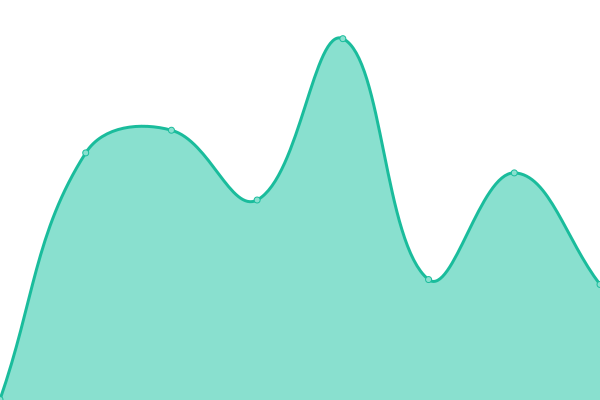

# [📈 Live Status](https://fraserbooth.github.io/fb-monitor): <!--live status--> **🟩 All systems operational**

This repository contains the open-source uptime monitor and status page for [fraserbooth](https://fraserbooth.github.io/fb-monitor), powered by [Upptime](https://github.com/upptime/upptime).

With [Upptime](https://upptime.js.org), you can get your own unlimited and free uptime monitor and status page, powered entirely by a GitHub repository. We use [Issues](https://github.com/fraserbooth/optbp-monitor/issues) as incident reports, [Actions](https://github.com/fraserbooth/optbp-monitor/actions) as uptime monitors, and [Pages](https://fraserbooth.github.io/fb-monitor) for the status page.

<!--start: status pages-->
<!-- This summary is generated by Upptime (https://github.com/upptime/upptime) -->
<!-- Do not edit this manually, your changes will be overwritten -->
<!-- prettier-ignore -->
| URL | Status | History | Response Time | Uptime |
| --- | ------ | ------- | ------------- | ------ |
|  [OptBP Site](http://www.optbp.com/) | 🟩 Up | [opt-bp-site.yml](https://github.com/fraserbooth/fb-monitor/commits/HEAD/history/opt-bp-site.yml) | 

 242ms
     
 | 

<a href="https://fraserbooth.github.io/fb-monitor/history/opt-bp-site">100.00%</a>
    

|  [Remote Check In Site](https://remote-check-in.github.io/rci-site/) | 🟩 Up | [remote-check-in-site.yml](https://github.com/fraserbooth/fb-monitor/commits/HEAD/history/remote-check-in-site.yml) | 

 74ms
     
 | 

<a href="https://fraserbooth.github.io/fb-monitor/history/remote-check-in-site">100.00%</a>
    

|  [Palma](https://www.comebacktopalma.info/) | 🟩 Up | [palma.yml](https://github.com/fraserbooth/fb-monitor/commits/HEAD/history/palma.yml) | 

 160ms
     
 | 

<a href="https://fraserbooth.github.io/fb-monitor/history/palma">100.00%</a>
    

|  [UAT Pt](http://optimise-bp-patient-uat.azurewebsites.net/) | 🟩 Up | [uat-pt.yml](https://github.com/fraserbooth/fb-monitor/commits/HEAD/history/uat-pt.yml) | 

 1133ms
     
 | 

<a href="https://fraserbooth.github.io/fb-monitor/history/uat-pt">100.00%</a>
    

|  [UAT Clin](https://optimise-bp-clinician-uat.azurewebsites.net/) | 🟩 Up | [uat-clin.yml](https://github.com/fraserbooth/fb-monitor/commits/HEAD/history/uat-clin.yml) | 

 955ms
     
 | 

<a href="https://fraserbooth.github.io/fb-monitor/history/uat-clin">100.00%</a>
    

|  [UAT Auth](https://optimise-bp-auth-uat.azurewebsites.net/Account/LoginWithPasscode) | 🟩 Up | [uat-auth.yml](https://github.com/fraserbooth/fb-monitor/commits/HEAD/history/uat-auth.yml) | 

 1318ms
     
 | 

<a href="https://fraserbooth.github.io/fb-monitor/history/uat-auth">100.00%</a>
    

|  [Aura-Soma](https://www.aura-soma.com/) | 🟩 Up | [aura-soma.yml](https://github.com/fraserbooth/fb-monitor/commits/HEAD/history/aura-soma.yml) | 

 1787ms
     
 | 

<a href="https://fraserbooth.github.io/fb-monitor/history/aura-soma">100.00%</a>
    

|  [AEOS](https://www.aeos.net/) | 🟩 Up | [aeos.yml](https://github.com/fraserbooth/fb-monitor/commits/HEAD/history/aeos.yml) | 

 408ms
     
 | 

<a href="https://fraserbooth.github.io/fb-monitor/history/aeos">100.00%</a>
    

|  [ShireFarm](https://www.shirefarm.co.uk/) | 🟩 Up | [shire-farm.yml](https://github.com/fraserbooth/fb-monitor/commits/HEAD/history/shire-farm.yml) | 

 324ms
     
 | 

<a href="https://fraserbooth.github.io/fb-monitor/history/shire-farm">100.00%</a>
    

|  [Pegasus](http://www.pegasus-parfum.com/) | 🟩 Up | [pegasus.yml](https://github.com/fraserbooth/fb-monitor/commits/HEAD/history/pegasus.yml) | 

 1121ms
     
 | 

<a href="https://fraserbooth.github.io/fb-monitor/history/pegasus">100.00%</a>
    

<!--end: status pages-->

[**Visit our status website →**](https://fraserbooth.github.io/optbp-monitor)

## 📄 License

- Powered by: [Upptime](https://github.com/upptime/upptime)
- Code: [MIT](./LICENSE) © [fraserbooth](https://fraserbooth.github.io/optbp-monitor)
- Data in the `./history` directory: [Open Database License](https://opendatacommons.org/licenses/odbl/1-0/)
